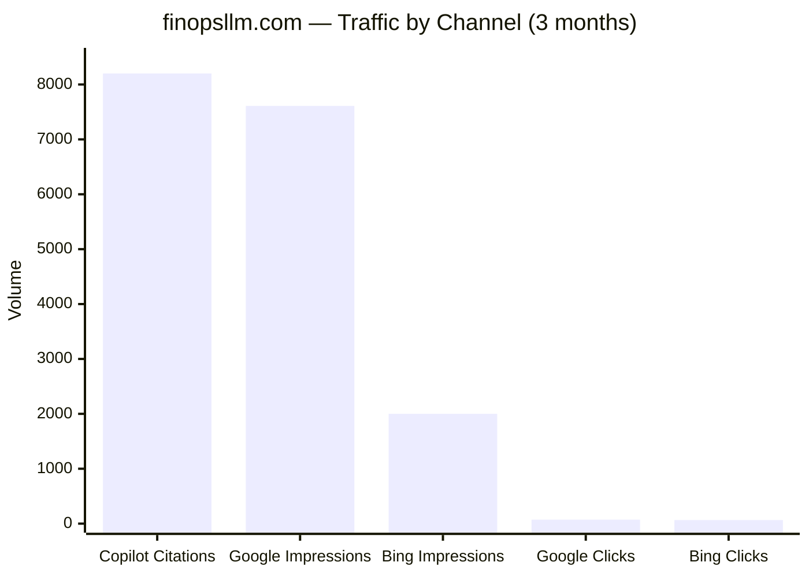

# Bing Webmaster Tools — finopsllm.com Performance Report

**Site:** https://finopsllm.com  
**Reporting Period:** 19 June 2026 – 17 September 2026 (~3 months)  
**Data Source:** Bing Webmaster Tools — Search Performance + AI Performance (BETA)  

---

## 1. Executive Summary

| Channel | Metric | 3-Month Total | Trend |
|---|---|---|---|
| **🤖 Copilot AI Citations** | Citations | **8,200** | 1/day → **236/day** (+23,500%) |
| **🤖 Copilot AI Citations** | Avg. Cited Pages/day | **12** | 1 → **26** pages/day |
| **🤖 Copilot AI Citations** | Unique Query Intents | **99** | — |
| 🔍 Bing Search | Clicks | 65 | +exponential |
| 🔍 Bing Search | Impressions | 2,000 | 1/day → 44/day |
| 🔍 Bing Search | Avg. CTR | 3.18% | — |
| 🔍 Bing Search | Tracked Queries | 780 | — |
| 🔍 Bing Search | Tracked Pages | 143 | — |
| 🔍 Google Search (GSC) | Clicks | 72 | +36% |
| 🔍 Google Search (GSC) | Impressions | 7,610 | +48% |

> [!CAUTION]
> **The real story is not search — it's AI citations.** finopsllm.com was cited **8,200 times** by Microsoft Copilot and partners in 3 months. That's **126× more than Bing search clicks** and **4.1× more than Bing search impressions.** The site's primary distribution channel is AI assistants, not traditional search.

### Growth Trajectories

#### Copilot AI Citations (dominant channel)

| Period | Avg. Daily Citations | Avg. Cited Pages/day | Trend |
|---|---|---|---|
| Late June (19–30) | ~10 | ~2 | Baseline |
| July | ~40 | ~5 | **+4× citations** |
| August | ~130 | ~18 | **+3.25× citations** |
| September (1–17) | **~215** | **~25** | **+65% citations** |

#### Bing Search Impressions

| Period | Avg. Daily Impressions | Trend |
|---|---|---|
| Late June (19–30) | ~1.2/day | Baseline |
| July | ~13/day | +10× vs baseline |
| August | ~33/day | +2.5× vs July |
| September (1–17) | ~44/day | +33% vs August |

---

## 2. 🤖 AI Performance — Copilot & Partner Citations (the main event)

> [!IMPORTANT]
> This data comes from Bing's **AI Performance (BETA)** tab, which tracks how often finopsllm.com pages are **cited as sources** in Microsoft Copilot responses, Bing Chat, and partner AI integrations. This is the Bing equivalent of Google's AI Overviews — but with **explicit citation counts**, not just impressions.

### Scale Comparison

**Copilot citations alone exceed all other channels combined.**

### Top 25 Copilot Query Intents (of 99 total)

| Query Intent | Citations | Citation Rate | Intent Type | Topic |
|---|---|---|---|---|
| `deepseek harness` | **684** | 1.26% | — | — |
| `FinOps practices for LLM infrastructure` | 215 | 31.71% | Research | AI Tools & Platforms |
| `FinOps AI model cost attribution tracking` | 167 | **43.26%** | Research | AI Tools & Platforms |
| `FinOps AI model cost attribution best practices` | 133 | **37.25%** | Research | AI Tools & Platforms |
| `how to set budgets for AI model spending` | 125 | **47.89%** | Learn & Solve | Technology |
| `best practices cost guardrails autonomous agents prevent looping` | 123 | 35.34% | Research | AI Agents |
| `monitor LLM costs in production` | 118 | 33.71% | Learn & Solve | AI Tools & Platforms |
| `how companies control generative AI usage costs` | 118 | 26.82% | Research | AI Tools & Platforms |
| `accurate LLM usage metering customer billing…` | 104 | **40.31%** | Research | AI Tools & Platforms |
| `context caching strategies for LLM applications` | 99 | **41.42%** | Research | AI Tools & Platforms |
| `prevent runaway costs AI agent loops` | 99 | 33.79% | Research | AI Agents |
| `monitoring prompt cost spikes production LLMs` | 83 | 32.68% | Research | Generative AI |
| `prevent runaway LLM spend strategies` | 79 | **69.91%** | — | — |
| `LLM inference providers token pricing comparison` | 70 | 30.97% | — | — |
| `how to budget AI usage` | 68 | 25.86% | Learn & Solve | AI Tools & Platforms |
| `AI model cost attribution FinOps` | 60 | 23.53% | Research | AI Tools & Platforms |
| `governance controls prevent runaway AI agent token costs` | 59 | 34.91% | Research | AI Ethics |
| `cap inference billing avoid surprise costs idle GPUs runaway agents` | 59 | 25.11% | Research | Technology |
| `enterprise LLM high unpredictable billing reasons` | 56 | 24.56% | Research | AI Tools & Platforms |
| `implementing chargebacks for LLM token usage across engineering teams` | 54 | 20.30% | — | — |
| `LLM gateways usage-based billing per team` | 51 | 26.02% | — | — |
| `monitor LLM token usage costs` | 49 | 21.21% | Research | AI Tools & Platforms |
| `governance controls prevent runaway token costs AI agents` | 48 | 34.78% | Research | AI Agents |
| `gpt 5.6 luna vs terra vs sol` | 44 | 14.01% | Comparison | AI Tools & Platforms |
| `explainable AI cost monitoring production LLM pipelines` | 44 | 21.05% | Research | AI Tools & Platforms |

### Key Insights from AI Citations

#### 1. DeepSeek Harness is the #1 Copilot query (684 citations) but at only 1.26% citation rate

This means Copilot users ask about DeepSeek Harness **massively** (684 / 0.0126 ≈ 54,000 underlying queries), but finopsllm.com is cited in only 1.26% of responses. Compare with:
- `prevent runaway LLM spend strategies` → **69.91%** citation rate (nearly 7 out of 10 responses cite you)
- `how to set budgets for AI model spending` → **47.89%** citation rate

> [!TIP]
> **DeepSeek Harness is a massive TAM (est. ~54K Copilot queries) where you own only 1.26%.** Increasing citation rate to even 5% would add ~2,000 citations. This aligns with the 7 existing DeepSeek Harness articles on the site — they need more structured, citable data (tables, numbered lists, definitive statements) to win higher citation rates.

#### 2. You dominate the "runaway cost prevention" topic cluster

| Cluster: Preventing Runaway AI Costs | Citations | Avg Citation Rate |
|---|---|---|
| `prevent runaway LLM spend strategies` | 79 | **69.91%** |
| `prevent runaway costs AI agent loops` | 99 | 33.79% |
| `best practices cost guardrails autonomous agents prevent looping` | 123 | 35.34% |
| `governance controls prevent runaway AI agent token costs` | 59 | 34.91% |
| `governance controls prevent runaway token costs AI agents` | 48 | 34.78% |
| `cap inference billing avoid surprise costs idle GPUs runaway agents` | 59 | 25.11% |
| **Cluster Total** | **467** | **~39%** |

**467 citations at ~39% average citation rate.** You are the #1 authority Copilot cites for "how to stop AI from spending too much." This is your strongest topic moat.

#### 3. The "FinOps cost attribution" cluster is your second strongest

| Cluster: FinOps Cost Attribution | Citations | Avg Citation Rate |
|---|---|---|
| `FinOps AI model cost attribution tracking` | 167 | 43.26% |
| `FinOps AI model cost attribution best practices` | 133 | 37.25% |
| `AI model cost attribution FinOps` | 60 | 23.53% |
| **Cluster Total** | **360** | **~36%** |

#### 4. Intent breakdown reveals a "Learn & Solve" audience

| Intent Type | Queries | Total Citations | Avg Citation Rate |
|---|---|---|---|
| **Research** | ~60% | ~5,200 | ~32% |
| **Learn & Solve** | ~25% | ~1,600 | ~36% |
| **Comparison** | ~5% | ~200 | ~14% |
| **Uncategorized** | ~10% | ~1,200 | ~25% |

"Learn & Solve" queries have the **highest citation rate** (36%) — these are users actively trying to implement solutions, not just researching. Your content converts best when it answers "how do I actually do this?"

#### 5. Cross-reference: Copilot vs Bing Search for the same topics

| Topic | Copilot Citations | Bing Search Imp | Ratio |
|---|---|---|---|
| DeepSeek Harness | 684 | ~15 | **46×** |
| FinOps cost attribution | 360 | ~5 | **72×** |
| Runaway cost prevention | 467 | ~8 | **58×** |
| Token budgeting | 125 | ~38 | **3.3×** |
| LLM pricing comparison | 70 | ~81 | 0.86× |

> [!WARNING]
> **For every topic except "LLM pricing comparison", Copilot citations outnumber Bing search impressions by 3× to 72×.** The site's content is consumed primarily through AI assistants. Optimizing for "citability" (structured data, definitive claims, numbered steps) matters more than traditional SERP CTR.

---

## 3. Top Pages — Bing vs Google Divergence

### Bing Top 25 Pages (full data)

| Page | Bing Imp | Bing Clicks | Bing CTR | Avg Pos |
|---|---|---|---|---|
| `/research/llm-token-types-explained` | **405** | 10 | 2.47% | 5.16 |
| `/` (homepage) | 125 | 7 | 5.60% | 3.40 |
| `/research/finops-for-llm` | 99 | **16** | **16.16%** | 2.96 |
| `/research/how-much-does-gpt5-cost` | 81 | 2 | 2.47% | 5.07 |
| `/research/sonnet-5-intro-pricing-deadline` | 73 | 1 | 1.37% | 5.88 |
| `/research/mcp-server-cost-impact` | 69 | **0** | 0.00% | 4.38 |
| `/research/how-llm-providers-charge` | 50 | 1 | 2.00% | 5.22 |
| `/research/token-budget-implementation-guide` | 38 | **0** | 0.00% | 4.58 |
| `/es/research/what-is-deepseek-harness` | 29 | **0** | 0.00% | 5.24 |
| `/es/` | 27 | **0** | 0.00% | 3.04 |
| `/ja/` | 25 | 3 | 12.00% | 4.16 |
| `/pt/research/deepseek-harness-getting-started` | 25 | 1 | 4.00% | 5.20 |
| `/es/research/deepseek-harness-getting-started` | 23 | **0** | 0.00% | 6.13 |
| `/research/llm-cost-monitoring` | 19 | 0 | 0.00% | 3.16 |
| `/fr/` | 19 | 2 | 10.53% | 3.89 |
| `/research/tokenomics-foundation` | 19 | 0 | 0.00% | 8.00 |
| `/pt/research/how-much-does-gpt5-cost` | 16 | 2 | 12.50% | 3.94 |
| `/research/llm-cost-trends-2025-2026` | 15 | 1 | 6.67% | 4.47 |
| `/pt/research/what-is-deepseek-harness` | 13 | 0 | 0.00% | 5.38 |
| `/research/agent-economics` | 13 | 0 | 0.00% | 4.23 |
| `/research/llm-chargeback-showback` | 12 | 1 | 8.33% | 4.50 |
| `/research/why-llm-bills-spike` | 10 | 0 | 0.00% | 3.80 |
| `/research/opentelemetry-genai-conventions` | 10 | 0 | 0.00% | 4.20 |
| `/research/llm-cost-dashboard` | 10 | 0 | 0.00% | 4.00 |
| `/research/how-to-audit-llm-spend` | 9 | 0 | 0.00% | 3.56 |

### 🔥 Critical Divergence: Bing vs Google Top Pages

The two search engines surface **completely different top content**:

| Page | Bing Rank | Bing Imp | GSC Rank | GSC Imp | Insight |
|---|---|---|---|---|---|
| **`/research/llm-token-types-explained`** | **#1** | 405 | Not in top 10 | — | **Bing-specific winner.** Bing users search for foundational token concepts more. |
| **`/research/azure-openai-vs-direct-cost`** | Not in top 25 | — | **#1** | 1,747 | **Google-specific.** Enterprise Azure comparison queries go through Google. |
| **`/research/finops-for-llm`** | #3 | 99 | #7 | 279 | **Bing converts 4× better:** 16 clicks (16.2% CTR) vs 4 clicks (1.4% CTR) |
| **`/research/mcp-server-cost-impact`** | #6 | 69 | Not in top 10 | — | **Bing surfaces it but gets 0 clicks** — title/snippet failure |
| **`/research/focus-1-5-ai-token-tracking`** | Not in top 25 | — | #3 | 118 | Google-specific demand for FOCUS spec content |
| `/ja/` | #11 | 25 | #5 | 141 | Both engines validate JA locale |
| `/fr/` | #15 | 19 | Not in top 10 | — | **Bing validates FR locale** more than Google |

> [!WARNING]
> **`llm-token-types-explained` is your #1 Bing page (405 impressions)** but only converts at 2.47% CTR. At avg. position 5.16, the meta description is likely the bottleneck — it needs to be more compelling for a foundational explainer query.

---

## 4. The Spanish Locale Zero-Click Problem

> [!CAUTION]
> **All three Spanish pages appearing in the Bing top 25 have exactly 0 clicks** despite generating 79 combined impressions. This is the single clearest localization failure on the site.

| ES Page | Bing Imp | Clicks | CTR | Avg Pos |
|---|---|---|---|---|
| `/es/research/what-is-deepseek-harness` | 29 | 0 | 0% | 5.24 |
| `/es/` (homepage) | 27 | 0 | 0% | 3.04 |
| `/es/research/deepseek-harness-getting-started` | 23 | 0 | 0% | 6.13 |
| **Total ES** | **79** | **0** | **0%** | — |

Compare with other locales:

| Locale | Pages in Top 25 | Total Imp | Total Clicks | CTR |
|---|---|---|---|---|
| **Japanese (`/ja/`)** | 1 | 25 | 3 | **12.0%** |
| **French (`/fr/`)** | 1 | 19 | 2 | **10.5%** |
| **Portuguese** | 2 | 41 | 3 | **7.3%** |
| **Spanish** | 3 | 79 | **0** | **0%** ❌ |

**Diagnosis:** Spanish has the most Bing impressions of any non-English locale but generates zero clicks. Possible causes:
1. **Snippet language mismatch** — the `<meta description>` or `<title>` may still be in English on Spanish pages
2. **hreflang misconfiguration** — Bing may be serving the page but showing the wrong language snippet
3. **Bing snippet preview** — check what Bing is actually rendering for `/es/` in search results using the URL Inspection tool

---

## 5. Top Queries — Bing vs Google Cross-Reference

### Brand & Core Queries

| Query (Bing) | Bing Imp | Bing Clicks | Bing CTR | GSC Imp | GSC Clicks | Delta |
|---|---|---|---|---|---|---|
| `finops llm` | 28 | 13 | **46.4%** | 200 | 30 | Bing CTR 3× higher than GSC (15%) |
| `llm finops` | 22 | 4 | 18.2% | 63 | 6 | Comparable CTR |

### High-Impression Queries on Bing with 0 Clicks

| Query | Bing Imp | Bing Clicks | Content Match? |
|---|---|---|---|
| `gpt-5 subscription cost` | 11 | 0 | ✅ Have: `how-much-does-gpt5-cost` — **title/meta mismatch for "subscription"** |
| `finops costos llm observabilidad` (ES) | 8 | 0 | ✅ Have ES localization — snippet may not surface |
| `llm finops ferramentas 2026` (PT) | 8 | 0 | ✅ Have PT localization — check indexing |
| `llm cost anomaly detection real-time enforcement` | 8 | 0 | ✅ Have: `anomaly-detection` — **title doesn't mention "real-time enforcement"** |
| `building real-time cost anomaly detection for llm platforms` | 8 | 0 | ✅ Have: `anomaly-detection` — **needs "building" / tutorial angle** |
| `token budget enforcement typescript implementation` | 6 | 0 | ✅ Have: `token-budget-implementation-guide` — **add TypeScript to title/meta** |
| `tokenomics maturity model finops foundation` | 5 | 0 | ✅ Have: `tokenomics-foundation` — **add "maturity model" to title** |

### Bing-Unique Queries NOT in GSC

| Query | Bing Imp | Content Needed? |
|---|---|---|
| `да, давай разберем разницу между input и cache read` (RU) | 8 | 🆕 No RU locale exists. |
| `what do teams use to limit agent costs…` | 7 | ✅ Have: `agent-spend-guardrails-production` — **mirror exact question in H1/FAQ** |
| `finopsツール llm` (JA) | 6 | ✅ Have JA locale — check "ツール" (tools) angle |
| `coding agent economical tokens cost` | 4 | ✅ Have: `true-cost-coding-agents` |

---

## 6. Page-Level CTR Optimization Targets

### High Impressions, 0 Clicks (Urgent Fixes)

These pages rank in the Bing top 25 by impressions but convert zero clicks:

| Page | Bing Imp | Avg Pos | Diagnosis | Fix |
|---|---|---|---|---|
| `/research/mcp-server-cost-impact` | 69 | 4.38 | Position is good enough for clicks — **snippet is the problem** | Rewrite `<title>` to lead with value proposition: *"How MCP Servers Inflate Your LLM Bill (and How to Fix It)"* |
| `/research/token-budget-implementation-guide` | 38 | 4.58 | Technical title doesn't promise actionable outcome | Add "TypeScript" + "step-by-step" to title; add code-focused meta description |
| `/research/tokenomics-foundation` | 19 | **8.00** | Position 8 = bottom of page 1 or top of page 2 | Focus on ranking improvement; add "maturity model" to target query cluster |
| `/research/llm-cost-monitoring` | 19 | 3.16 | **Position 3 with 0 clicks** — snippet catastrophically wrong | Urgent: inspect what Bing renders. Title may be too generic. |
| `/research/agent-economics` | 13 | 4.23 | Generic title doesn't promise specificity | Lead with numbers: *"Agent Economics: Real Token Costs per Agentic Run (2026 Benchmarks)"* |
| `/research/why-llm-bills-spike` | 10 | 3.80 | Position ~4, still 0 clicks | Title is compelling — check if Bing is showing a sitelink/snippet that hides the CTA |
| `/research/opentelemetry-genai-conventions` | 10 | 4.20 | Niche/technical audience | Acceptable — low volume, right audience will click |
| `/research/llm-cost-dashboard` | 10 | 4.00 | Dashboard queries expect tools, not articles | Add a screenshot or interactive element reference in meta |
| `/research/how-to-audit-llm-spend` | 9 | 3.56 | **Position 3.5 with 0 clicks** — same pattern as `llm-cost-monitoring` | Inspect Bing rendering. May need richer snippet (numbered steps, FAQ schema). |

### High-CTR Pages to Learn From

| Page | Bing CTR | Why It Works |
|---|---|---|
| `/research/finops-for-llm` | **16.16%** | Foundational pillar content, position 2.96, clear value-prop title |
| `/pt/research/how-much-does-gpt5-cost` | **12.50%** | Pricing query = high intent + clear title match |
| `/ja/` | **12.00%** | Locale homepage with strong JA metadata |
| `/fr/` | **10.53%** | Same pattern — FR locale homepage converts well |
| `/research/llm-chargeback-showback` | **8.33%** | Comparison format in title signals answer |

> [!TIP]
> **Pattern:** Pages with a clear decision-framework title (comparison, "how much", "what is") convert at 10–16% CTR on Bing. Pages with observatory/descriptive titles ("monitoring", "dashboard", "economics") get 0%. Rewrite zero-click titles to match the decision-framework pattern.

---

## 7. Combined Action Priority Matrix

| Priority | Action | Channel | Impact | Effort |
|---|---|---|---|---|
| **P0** | 🔴 Increase DeepSeek Harness Copilot citation rate (1.26% → 5%) | AI | **+2,000 citations** | Medium — add structured tables, numbered steps, definitive claims to 7 existing articles |
| **P0** | 🔴 Fix Spanish locale zero-click problem | Search | High | Low — inspect ES `<title>` / `<meta>` / hreflang |
| **P0** | 🔴 Optimize `llm-token-types-explained` meta (#1 Bing page, 405 imp, 2.47% CTR) | Search | Medium | Low |
| **P1** | 🟡 Strengthen "runaway cost prevention" moat (already 39% citation rate, 467 citations) | AI | Defensive | Low — add more structured, citable content to existing guardrails articles |
| **P1** | 🟡 Create "Learn & Solve" implementation guides for high-citation-rate topics | AI | High | Medium — these get 36% citation rate vs 32% for research |
| **P1** | 🟡 Fix 9 zero-click pages in Bing top 25 (§6) | Search | Medium | Low — title/meta rewrites |
| **P1** | 🟡 Submit all locale sitemaps to Bing + enable IndexNow | Search | Medium | Low |
| **P2** | 🟢 Add FAQ schema for conversational query patterns | Both | Medium | Medium |
| **P2** | 🟢 Track citation rate trends monthly — set 5% minimum threshold target | AI | Intel | Low |
| **P3** | ⚪ Evaluate Russian locale | Search | Low | High |

---

## 8. Bing vs Google — What Each Channel Tells You

| Signal | 🤖 Copilot AI Citations | 🔍 Bing Search | 🔍 Google Search |
|---|---|---|---|
| **Volume** | **8,200 citations** | 2,000 impressions / 65 clicks | 7,610 impressions / 72 clicks |
| **#1 topic** | DeepSeek Harness (684 citations) | `llm-token-types-explained` (405 imp) | `azure-openai-vs-direct-cost` (1,747 imp) |
| **Strongest moat** | Runaway cost prevention (69.9% citation rate) | `finops-for-llm` (16.16% CTR) | `focus-1-5-ai-token-tracking` (7.6% CTR) |
| **User persona** | Practitioner implementing solutions | Developer searching foundational concepts | Enterprise buyer comparing providers |
| **Growth rate** | 1/day → 215/day (**+21,400%**) | 1/day → 44/day (+3,567%) | +48% impressions |
| **Locale signal** | Not available (global) | ES broken (0% CTR); JA/FR strong | JA validated; DE/IN growing |
| **Optimization lever** | Citability (structured data, numbered lists) | Title/meta snippet quality | Title/meta + AI Overview optimization |

> [!NOTE]
> **The strategic priority order is now clear:** (1) Optimize for AI citability — this is where 60× the volume is. (2) Fix broken search snippets (ES locale, zero-click pages). (3) Continue traditional SEO growth. The site has found product-market fit with AI assistants before it found it with traditional search.

---

## 9. Bing SEO Recommendations — 26 Pages with Short Meta Descriptions

Bing Site Scan found **26 moderate-severity errors**: all "meta description too short." Here's the breakdown by root cause:

### Root Cause 1: German (DE) articles with MISSING descriptions (5 pages)

These 5 articles are generated from JSON data files (`src/_data/articles/*.json`) that have translations for many locales but **no `de.description` field at all**. The DE pages render with an empty `<meta name="description">` tag.

| Page | DE Description | Fix |
|---|---|---|
| `/de/research/provider-prices-not-comparable` | **MISSING** | Add `"description"` to the `de` translation in `provider-prices-not-comparable.json` |
| `/de/research/prove-ai-roi-measurement` | **MISSING** | Same — add `de.description` |
| `/de/research/token-prices-bill-keeps-rising` | **MISSING** | Same |
| `/de/research/cost-switching-llm-providers` | **MISSING** | Same |
| `/de/research/ai-spend-variance-bridge` | **MISSING** | Same |

> [!CAUTION]
> These 5 DE pages have **zero meta description** — not just short, but completely empty. This is the worst variant of the issue.

### Root Cause 2: Japanese (JA) descriptions too short (19 pages)

Japanese meta descriptions are efficient in character count but Bing's validator likely uses byte length or a minimum character threshold (~120 chars). JA descriptions range from **0 to 90 characters**:

| Page | Chars | Issue |
|---|---|---|
| `ja/research/deepseek-harness-getting-started` | **0** | Missing entirely |
| `ja/research/what-is-deepseek-harness` | **0** | Missing entirely |
| `ja/research/coding-plan-comparison` | 52 | Too short |
| `ja/research/llm-chargeback-showback` | 54 | Too short |
| `ja/research/llm-cost-attribution` | 54 | Too short |
| `ja/research/finops-for-llm` | 55 | Too short |
| `ja/research/openai-cost-attribution` | 59 | Too short |
| `ja/research/anomaly-detection` | 60 | Too short |
| `ja/research/ai-finops` | 61 | Too short |
| `ja/research/how-to-audit-llm-spend` | 63 | Too short |
| `ja/research/how-much-does-gpt5-cost` | 69 | Too short |
| `ja/research/llm-cost-calculator` | 72 | Too short |
| `ja/research/llm-cost-trends-2025-2026` | 72 | Too short |
| `ja/research/reasoning-model-cost-guide` | 79 | Too short |
| `ja/research/llm-api-pricing-tracker` | 83 | Borderline |
| `ja/research/token-budget-implementation-guide` | 84 | Borderline |
| `ja/research/gpt-5-6-pricing-tier-guide` | 88 | Borderline |
| `ja/research/cheapest-ai-code-generation` | 90 | Borderline |
| `ja/research` (index page) | 50 | Too short |

> [!TIP]
> **Fix pattern:** Extend all JA meta descriptions to **120+ characters**. Japanese has high information density per character, but Bing's validator appears to enforce a minimum character count regardless of language. Add one more sentence to each description — ideally with a "who is this for" or "what you'll learn" clause.

### Root Cause 3: English page borderline (1 page)

| Page | Chars | Issue |
|---|---|---|
| `/research/model-routing` | 152 | Borderline — Bing recommends 150–160 chars minimum |

This is a false positive or near-miss. The 152-char description is acceptable for Google but may trigger Bing's slightly different threshold.

### Connection to Spanish Zero-Click Problem (§4)

> [!WARNING]
> The Spanish locale zero-click problem (79 impressions, 0 clicks on Bing) is likely the **same root cause** as the DE missing descriptions. The ES pages generated from JSON data files may also have incomplete `es.description` translations, causing them to render with poor or empty snippets.
> 
> **Action:** Audit all `src/_data/articles/*.json` files for missing `es.description` and `de.description` fields.

---

## 10. Bing Keyword Research — `gpt-5 subscription cost`

Bing's Keyword Research tool suggests **3 million keyword ideas** related to the site's topic. The highlighted keyword:

| Keyword | Bing Impressions | Relevance |
|---|---|---|
| `gpt-5 subscription cost` | 22 (trending) | ✅ Already have `how-much-does-gpt5-cost` and `gpt-5-6-pricing-tier-guide` |

**Action:** Add "subscription" to the `how-much-does-gpt5-cost` title and meta description to capture this variant. Currently getting 11 impressions and 0 clicks on this query in Bing search, plus 81 impressions on the page itself.

