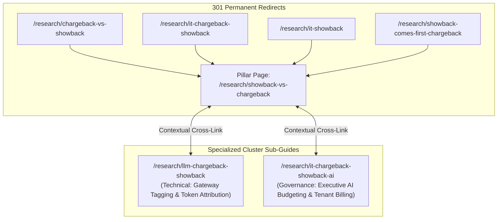

# Architectural Plan: Showback vs Chargeback Keyword Cannibalization Consolidation

> **Context**: Google Search Console reports **410 impressions with 0 clicks** on the query `"showback vs chargeback"` for `finopsllm.com`.
> **Root Cause**: Keyword cannibalization across 7 overlapping articles diluting link equity, confusing Googlebot ranking algorithms, and suppressing search position to page 2 (positions 10–18).
> **Target Status**: **DO NOT EXECUTE YET** — Designed for handoff to a specialized optimization agent.

---

## 1. Audit of the 7 Competing URLs

The site currently has 7 standalone pages with near-identical search intent:

| # | File / Route | Current `<title>` | Canonical Target | Primary Intent Overlap |
|---|---|---|---|---|
| 1 | `research/showback-vs-chargeback` | Showback vs Chargeback: Which Model Fits Your Team? · FinOps LLM | Self | General definition, differences, failure modes |
| 2 | `research/chargeback-vs-showback` | Chargeback vs Showback: Picking the Right FinOps Model · FinOps LLM | Self | Direct inverted synonym of #1 |
| 3 | `research/it-chargeback-showback` | IT Chargeback and Showback Explained · FinOps LLM | Self | Cloud IT cost allocation explanation |
| 4 | `research/it-chargeback-showback-ai`| IT Chargeback and Showback for AI: A Practical Guide · FinOps LLM | Self | AI-specific allocation rules |
| 5 | `research/llm-chargeback-showback` | LLM Chargeback and Showback: Design Guide · FinOps LLM | Self | Enterprise LLM gateway showback/chargeback |
| 6 | `research/showback-comes-first-chargeback` | Why Showback Comes Before Chargeback in FinOps · FinOps LLM | Self | Maturity model, transition sequence |
| 7 | `research/it-showback` | IT Showback: A Practical Guide for Technology Teams · FinOps LLM | Self | Sub-topic dedicated solely to showback |

### Why Google Shows 410 Impressions & 0 Clicks
1. **Ranking Instability (Keyword Flipping)**: Google's ranking algorithms swap among these 7 URLs depending on slight query nuances (`showback vs chargeback`, `chargeback vs showback`, `difference between showback and chargeback`).
2. **Authority Fragmentation**: Backlinks and internal links are split 7 ways instead of compounding onto a single pillar page.
3. **Sub-Optimal CTR Metadata**: The current titles lack high-CTR hooks (e.g. decision tree, templates, calculation frameworks, or explicit 2026 enterprise guides) to win clicks from searchers.

---

## 2. Recommended Strategy: The Pillar & Cluster Architecture

Rather than deleting content indiscriminately, the agent executing this plan should restructure these into **one canonical Pillar Authority Page** supported by **two differentiated technical sub-guides**, with the remaining 4 legacy URLs permanently 301-redirected.



### The Roles:
1. **Primary Pillar URL**: `https://finopsllm.com/research/showback-vs-chargeback`
   - Target Query: `"showback vs chargeback"`, `"chargeback vs showback"`, `"difference between showback and chargeback"`.
   - Comprehensive comparative guide, visual decision framework, maturity transition checklist, and downloadable accounting spreadsheet template.
2. **Cluster 1 (Technical Implementation)**: `https://finopsllm.com/research/llm-chargeback-showback`
   - Focus: API gateway tagging, per-request header injection, token counting, and OpenTelemetry GenAI telemetry attribution.
3. **Cluster 2 (Governance & AI Accounting)**: `https://finopsllm.com/research/it-chargeback-showback-ai`
   - Focus: Internal billing models, GPU allocation, multi-tenant chargeback disputes, and shared cost absorption.

---

## 3. Detailed Execution Plan for the Implementing Agent

### Phase 1: Enrich the Primary Pillar Page (`showback-vs-chargeback.njk`)
Consolidate the best sections from the 4 redundant pages into `showback-vs-chargeback.njk`:
- **Title**: `Showback vs Chargeback: FinOps Decision Guide & Template · FinOps LLM` (66 chars, high CTR).
- **Meta Description**: `Showback vs chargeback: compare IT & AI cost models. Discover which fits your team, transition frameworks, failure modes, and budget ownership rules.` (160 chars).
- **Add Interactive/Structured Content**:
  - Comparison matrix (Visibility, Budget Impact, Friction, Prerequisites, Cultural readiness).
  - Transition readiness scorecard (Do you have >95% allocation data? Are unit economics established?).
  - Enhanced JSON-LD Schema: `TechArticle`, `FAQPage`, and `HowTo` schema.

### Phase 2: Implement 301 Redirects in `_redirects` & Cloudflare Worker
Add permanent 301 redirects in `llm-cfo/sites/finops-llm/src/_redirects`:
```text
# Showback vs Chargeback consolidation
/research/chargeback-vs-showback             /research/showback-vs-chargeback 301
/research/it-chargeback-showback             /research/showback-vs-chargeback 301
/research/it-showback                        /research/showback-vs-chargeback 301
/research/showback-comes-first-chargeback    /research/showback-vs-chargeback 301
```

And in `src/worker.js`: ensure the static-assets proxy executes these 301 redirects cleanly before asset dispatch.

### Phase 3: Update Internal Links & Sitemaps
1. Search all templates and markdown files across `src/` for links to the 4 redirected URLs and update them directly to `/research/showback-vs-chargeback`.
2. Ensure `scripts/check-links.js` validates that 0 internal links point to 301 redirect targets.
3. Rebuild sitemaps (`npm run build`) so only the live, non-redirected canonical URLs are published.

### Phase 4: Submit Google Search Console URL Inspection
Once deployed:
1. Open Google Search Console for `finopsllm.com`.
2. Inspect `https://finopsllm.com/research/showback-vs-chargeback`.
3. Click **"Request Indexing"** to prompt Googlebot to re-index the consolidated master URL.
4. Monitor GSC Performance report over 14 days to observe CTR rise from 0% toward the standard 3–6% top-page benchmark.
